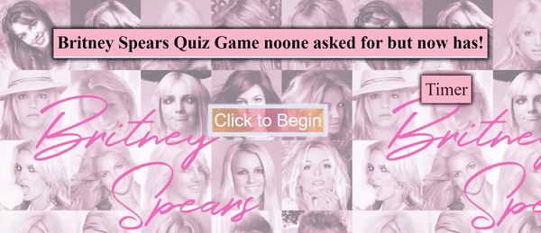

# codeQuiz_webAPIs

## User Story

```
AS A Britney Enthusiast
I WANT to take a timed quiz on JavaScript fundamentals that stores high scores
SO THAT I can gauge my progress compared to my peers
```

Acceptance Criteria:
```
- GIVEN I am taking a code quiz
- WHEN I click the start button
- THEN a timer starts and I am presented with a question
- WHEN I answer a question
- THEN I am presented with another question
- WHEN I answer a question incorrectly
- THEN time is subtracted from the clock
- WHEN all questions are answered or the timer reaches 0
- THEN the game is over
- WHEN the game is over
- THEN I can save my initials and my score
```
## Table of Contents
- [Strategy](#strategy)
- [Pseudo](#Pseudo)
- [Assets](#assets)
- [Links](#links)
- [Credits](#credits)
- [License](#license)


### State of Play - Strategy

| Task       | Progress      | 
| ------------- |:-------------:| 
| Build HTML, CSS and JS      | Complete | 
| Link above files to HTML | Complete |
| Build start Button to begin Game. Hide on click function | Complete |
| Activate a 60-sec timer and the first question from start button | Complete |
| Build multiple questions following the above process | Complete |
| Incorrect answers to reduce Countdown timer | Complete |
| Game is over once the timer hits Zero (0) or if the questions are answered| Complete |
| Prompt a input tag for the user to save their initials  | Complete |
| Build a local storage to track the previous score | Complete |
| Set Attributes from Lesson 05 from monday | Not required - NA |


## Pseudo Code
```
HTML:
1. Basic wireframe
2. Static header
3. Ordered list for of Questiosn items. List items
4. Two buttons Start and the Leaderboard to check Highscores
5. ID tags and classes to refer to in Javascript
```
```
CSS: 
1. reset default CSS
2. build a simple styling 
```
```
JS: 
1. Link start button to begin the game
2. build question first
3. build a time to count down from 60 seconds. include a tumeout. 
4. use form to stor 'player name'
5. create click lisetn event to sue in strat/stop and for the leader baord 
6. pulls question fromt he array and puts question in the ul and assign
```

## Assets



## Links
- Github link for reference is below: 
https://github.com/liamok19/codeQuiz_webAPIs.git

- Website Link for reference is below: 
https://liamok19.github.io/codeQuiz_webAPIs/

## Credits

Based on the research I found the following sources that I would like to credit for this project: 
| Source        | Platform      | Other  |
| ------------- |:-------------:| -----:|
| Web Dev Simplified    | Youtube      |Title: Build A Quiz App With JavaScript  | 
| #ask your classmaters | Slack      |Conversations between instructors and classmates |
| James Q Quick   | Youtube     | Title: Build a Quiz App (9) - Load and Display High Scores from Local Storage |
| Coding Destination   | Youtube     | Title: Multiple Choice Quiz using HTML,CSS and JavaScript.|
| JavaScript Academy  | Youtube      |Title: Create a simple tic tac toe game using HTML, CSS, JavaScript | 
| Zenva    | Youtube   |Title: Creating a Basic Quiz - JavaScript Tutorial | 
| The New Ninja    | Youtube   |Title: JavaScript ES6 Tutorial #5 - The Spread Operator| 
| W3school    | W3school   |Title: https://www.w3schools.com/quiztest/quiztest.asp?qtest=JS | 
| StackOverflow    | StackOverflow   |Title: https://stackoverflow.com/questions/4279611/how-to-embed-a-video-into-github-readme-md/4279746#4279746 | 
| MDN Web Docs | MDN Web Docs | Title: https://developer.mozilla.org/en-US/docs/Web/JavaScript/Reference/Global_Objects/JSON/parse | 


## License
- Existing projects and communities, this README file is publicly open for reference and review. 